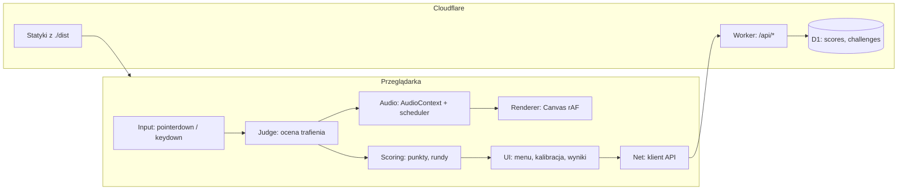

# 02. Architektura

## 1. Zasada nadrzędna

Cała logika czasowa gry odnosi się do jednego zegara: `AudioContext.currentTime`. Nie używamy `setTimeout`, `setInterval` ani `Date.now()` do synchronizacji z muzyką ani do oceny trafień. Powód: zegar audio jest jedynym zegarem zsynchronizowanym ze sprzętem odtwarzającym dźwięk.

## 2. Widok komponentów



## 3. Moduły

| Moduł | Odpowiedzialność | Zależności |
|---|---|---|
| `engine/config.ts` | okna oceny, punkty, kara za puste kliknięcie, czasy (`APPROACH_TIME`, `COUNTDOWN`) | brak |
| `engine/clock.ts` | wybór metody zegara, konwersja czasu zdarzeń na czas audio, kalibracja | `audio/context` |
| `engine/judge.ts` | dopasowanie kliknięcia do nuty, wyznaczenie oceny, puste kliknięcia | `engine/config` |
| `engine/scoring.ts` | wynik rundy i mapy z ocen i pustych kliknięć; współdzielony z Workerem | `engine/config` |
| `engine/session.ts` | stan rundy, pauza, przejścia między rundami | `judge`, `scoring`, `chart` |
| `engine/chart.ts` | parsowanie i walidacja mapy, rozwijanie pętli, składanie tła, konwersja beatów na sekundy | `engine/config` |
| `audio/context.ts` | pojedyncza instancja `AudioContext`, odblokowanie po geście | brak |
| `audio/synth.ts` | funkcje syntezy instrumentów, `stopAll()` | `audio/context` |
| `audio/scheduler.ts` | planowanie dźwięków warstw tła z wyprzedzeniem | `audio/synth`, `chart` |
| `render/canvas.ts` | rysowanie kółek, linii trafienia, efektów | `session` |
| `net/api.ts` | wywołania `/api/*` | brak |
| `ui/*` | ekrany: menu, kalibracja, runda, wyniki, ranking | pozostałe |

Zasady zależności: `engine` nie importuje `render` ani `ui`. `render` tylko odczytuje stan `session`. Dzięki temu `engine` da się testować bez przeglądarki (z atrapą zegara). `engine/chart`, `engine/scoring` i `engine/config` nie zależą od API przeglądarki, bo importuje je także Worker.

## 4. Przepływ pojedynczej rundy

1. Użytkownik wybiera mapę; `chart.ts` ładuje i waliduje JSON.
2. Pierwszy gest użytkownika odblokowuje `AudioContext` (`resume()`); `clock` wybiera metodę zegara i wczytuje kalibrację.
3. `session` ustawia `songStart = ctx.currentTime + 0,1 s`; wprowadzenie `leadInBeats` jest już wliczone w czasy nut.
4. `scheduler` planuje dźwięki tła (`toBacking`: poprzednie rundy i `ambient`) w oknie wyprzedzenia.
5. W każdej klatce `render` oblicza pozycję kółek z `ctx.currentTime` i `songStart`.
6. Na `pointerdown` `judge` wyznacza czas kliknięcia w skali audio i zwraca trafienie z oceną albo puste kliknięcie.
7. `synth` odtwarza natychmiast (`start(ctx.currentTime)`) instrument trafionej nuty albo, przy pustym kliknięciu, instrument nuty najbliższej w czasie.
8. Po ostatniej nucie ostatniej pętli `session` zamyka rundę, `scoring` liczy wynik, a UI pokazuje ekran wyników rundy. Kolejna runda startuje po geście gracza.
9. Po rundzie 5 wynik trafia do `net/api` (opcjonalnie).

Ukrycie karty lub pauza gracza w dowolnym momencie kroków 4–8 uruchamia procedurę pauzy (`03-timing-and-latency.md`, pkt 7).

## 5. Stan sesji

```ts
interface SessionState {
  chartId: string;
  roundIndex: number;          // 0..4
  phase: 'playing' | 'paused' | 'countdown' | 'round-results';
  songStart: number;           // sekundy, skala AudioContext
  frozenAt: number | null;     // pozycja zamrożona w trakcie odliczania po pauzie
  notes: PlayableNote[];       // nuty rundy do zagrania, pętle rozwinięte
  emptyTaps: number[];         // puste kliknięcia per runda
  perRound: number[];          // wynik per runda, po karze, >= 0
  score: number;               // suma perRound
  clockMethod: ClockMethod;
  calibrationOffset: number;   // sekundy
}

interface PlayableNote {
  time: number;                // sekundy od songStart
  instrument: InstrumentId;
  hit: boolean;
  grade?: 'perfect' | 'good' | 'ok' | 'miss';
}
```

## 6. Granica odpowiedzialności klient / serwer

Klient odpowiada za całą rozgrywkę. Serwer przyjmuje wyniki, waliduje je pod względem wiarygodności i udostępnia ranking. Serwer nigdy nie bierze udziału w pętli gry, więc jego opóźnienie nie wpływa na odczucie rozgrywki.
