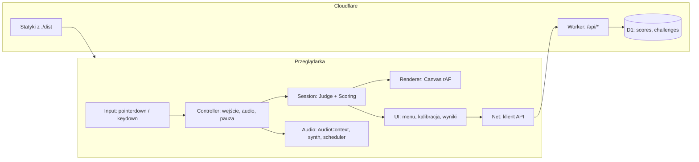

# 02. Architektura

## 1. Zasada nadrzędna

Cała logika czasowa gry odnosi się do jednego zegara: `AudioContext.currentTime`. Nie używamy `setTimeout`, `setInterval` ani `Date.now()` do synchronizacji z muzyką ani do oceny trafień. Powód: zegar audio jest jedynym zegarem zsynchronizowanym ze sprzętem odtwarzającym dźwięk.

## 2. Widok komponentów



## 3. Moduły

| Moduł | Odpowiedzialność | Zależności |
|---|---|---|
| `engine/types.ts` | wspólne typy: `InstrumentId`, `Grade`, `PlayableNote`, `BackingNote`, `ScorePayload` | brak |
| `engine/config.ts` | okna oceny w ms (`windowsMs`), punkty, kara za puste kliknięcie, czasy (`approachTime`, `countdown`) | brak |
| `engine/clock.ts` | wybór metody zegara, konwersja czasu zdarzeń na czas audio | `audio/context` |
| `engine/calibration.ts` | parowanie stuknięć z uderzeniami, `computeOffset`, odczyt i zapis `hitline.calibration` | `engine/clock` (typ `ClockMethod`) |
| `engine/judge.ts` | dopasowanie kliknięcia do nuty, puste kliknięcia | `engine/config`, `engine/scoring` |
| `engine/scoring.ts` | `gradeFor`, wynik rundy i mapy z ocen i pustych kliknięć; współdzielony z Workerem | `engine/config` |
| `engine/session.ts` | czysty automat stanów rundy: `onTap(tapTime)`, `update(now)`, pauza, przejścia między rundami, wyniki rund | `judge`, `scoring`, `chart` |
| `engine/chart.ts` | parsowanie i walidacja mapy, rozwijanie pętli, składanie tła, konwersja beatów na sekundy | `engine/config` |
| `game/controller.ts` | łączy wejście, zegar, `session`, `synth` i `scheduler`; procedura pauzy i wznowienia | `engine/*`, `audio/*` |
| `audio/context.ts` | pojedyncza instancja `AudioContext`, odblokowanie po geście | brak |
| `audio/synth.ts` | funkcje syntezy instrumentów, `play()`, `stopAll()` | `audio/context` |
| `audio/scheduler.ts` | planowanie dźwięków warstw tła z wyprzedzeniem | `engine/types` (funkcja `play` wstrzykiwana) |
| `render/canvas.ts` | rysowanie krążków, taśmy, nagłówka i efektów w stylu z `14-visual-style.md` | `session` (tylko odczyt), `render/style`, `render/stats` |
| `render/style.ts` | czyste funkcje stylu: drżenie, dopasowanie czcionki, limit błysków, generator ziarna | `engine/types` |
| `render/fonts.ts`, `render/stats.ts` | jawne ładowanie czcionki; pomiar czasu rysowania dla ekranu debug | brak |
| `net/api.ts` | wywołania `/api/*`, przechowanie i ponowienie niewysłanego wyniku | `engine/types` |
| `ui/*` | ekrany z `11-ux.md` | pozostałe |

Zasady zależności:

- `engine` nie importuje `render`, `ui`, `game` ani `audio`; wyjątkiem jest `engine/clock`, który potrzebuje `AudioContext`. Czas trafia do `session` jako liczba, więc `session` testuje się bez przeglądarki.
- `game/controller` jest jedynym miejscem, które łączy zdarzenia DOM, audio i `session`.
- `render` tylko odczytuje stan `session`.
- `engine/types`, `engine/chart`, `engine/scoring` i `engine/config` nie zależą od API przeglądarki, bo importuje je także Worker.

## 4. Przepływ pojedynczej rundy

1. Użytkownik wybiera mapę; `chart.ts` ładuje i waliduje JSON.
2. Pierwszy gest użytkownika odblokowuje `AudioContext` (`resume()`); `clock` wybiera metodę zegara, a `calibration` wczytuje offset.
3. `controller` ustawia `songStart = ctx.currentTime + max(0,1 s, approachTime - czas_pierwszej_nuty)` (`03-timing-and-latency.md`, pkt 8); wprowadzenie `leadInBeats` jest już wliczone w czasy nut.
4. `scheduler` planuje dźwięki tła (`toBacking`: poprzednie rundy i `ambient`) w oknie wyprzedzenia.
5. W każdej klatce `controller` wywołuje `session.update(ctx.currentTime)` (oznaczanie `miss`, koniec rundy), a `render` oblicza pozycję kółek z `ctx.currentTime` i `songStart`.
6. Na `pointerdown` w obszarze gry `controller` przy `phase === 'playing'` przelicza czas zdarzenia (`eventToAudioTime`, odjęcie offsetu) i wywołuje `session.onTap(tapTime)`, który zwraca trafienie z oceną albo puste kliknięcie. W innych fazach kliknięcie jest ignorowane.
7. `controller` odtwarza natychmiast przez `synth` instrument trafionej nuty albo, przy pustym kliknięciu, instrument nuty najbliższej w czasie.
8. Runda kończy się w chwili `max(koniec_ostatniej_pętli, ostatnia_nuta + windowsMs.ok)`. `session` zapisuje wyniki nut rundy w `results`, `scoring` liczy wynik, a UI pokazuje ekran wyników rundy. Kolejna runda startuje po geście gracza.
9. Po rundzie 5 wynik (z `hits` i `emptyTaps` zbudowanymi z `results`) trafia do `net/api` (opcjonalnie).

Ukrycie karty lub pauza gracza w dowolnym momencie kroków 4–8 uruchamia procedurę pauzy (`03-timing-and-latency.md`, pkt 7).

## 5. Stan sesji

```ts
interface SessionState {
  chartId: string;
  roundIndex: number;          // 0..4
  phase: 'playing' | 'paused' | 'countdown' | 'round-results';
  songStart: number;           // sekundy, skala AudioContext
  frozenAt: number | null;     // pozycja zamrożona w trakcie odliczania po pauzie
  notes: PlayableNote[];       // nuty bieżącej rundy, pętle rozwinięte
  results: PlayableNote[][];   // nuty zakończonych rund z ocenami i deltaMs
  emptyTaps: number[];         // puste kliknięcia per runda
  perRound: number[];          // wynik per runda, po karze, >= 0
  score: number;               // suma perRound
  clockMethod: ClockMethod;
  calibrationOffset: number;   // sekundy
}

// engine/types.ts
interface BackingNote {
  time: number;                // sekundy od songStart
  instrument: InstrumentId;
}

interface PlayableNote extends BackingNote {
  hit: boolean;
  grade?: Grade;
  deltaMs?: number;            // zaokrąglony błąd trafienia, tylko dla trafionych
}

interface ScorePayload {
  chart: string;
  player: string;
  score: number;
  hits?: [index: number, deltaMs: number][]; // indeks globalny, `04-chart-format.md`, pkt 6
  emptyTaps?: number[];
}
```

`results` jest potrzebne z dwóch powodów: z niego powstają `hits` dla walidacji poziomu 2 oraz zbiór `missed` dla wariantu B z ADR-006 (`toBacking(chart, n, missed)`).

## 6. Granica odpowiedzialności klient / serwer

Klient odpowiada za całą rozgrywkę. Serwer przyjmuje wyniki, waliduje je pod względem wiarygodności i udostępnia ranking. Serwer nigdy nie bierze udziału w pętli gry, więc jego opóźnienie nie wpływa na odczucie rozgrywki.
