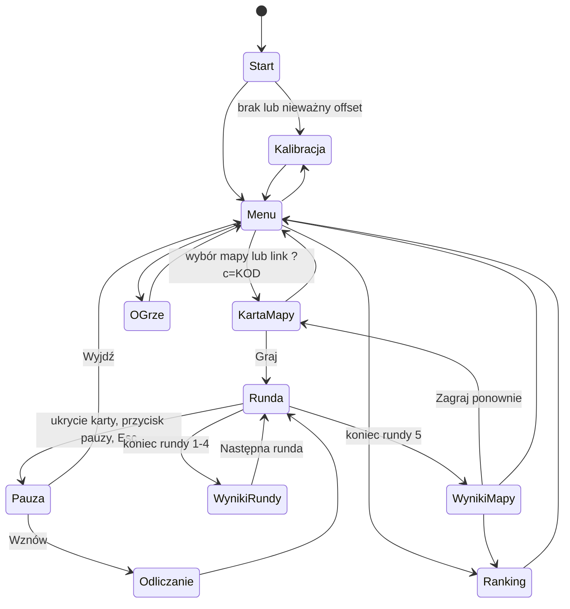

# 11. Ekrany i przepływ UX

Dokument opisuje ekrany gry, przejścia między nimi i komunikaty. Wygląd (kolory, typografia, animacje) nie jest tu określony.

## 1. Mapa przejść

## 2. Ekrany

### Start

- Pełnoekranowy komunikat „Dotknij, aby zacząć”.
- Gest odblokowuje `AudioContext`, uruchamia `detectClockMethod` i wczytuje kalibrację (`03-timing-and-latency.md`).
- Brak kalibracji albo kalibracja z inną metodą zegara: przejście do ekranu kalibracji z opcją „Pomiń” (gra z offsetem 0).
- Parametr `c` w URL jest zapamiętywany (wielkie litery) i obsługiwany po przejściu do menu. Od razu znika z paska adresu (`history.replaceState`), żeby odświeżenie strony nie otwierało wyzwania ponownie.

### Menu

- Lista map: tytuł, BPM, najlepszy lokalny wynik.
- Przyciski: „Kalibracja”, „Ranking”, „O grze”.
- Link z kodem wyzwania (`?c=KOD`): zapytanie `GET /api/challenges/:code`, a następnie karta wskazanej mapy. Nieznany kod lub niedostępne API: komunikat i zwykłe menu.

### Kalibracja

- Instrukcja: „Stukaj równo z uderzeniami”.
- Metronom: 10 uderzeń z sygnałem dźwiękowym i wizualnym; pierwsze 2 oznaczone jako rozgrzewka.
- Wynik: offset w ms i ocena rozrzutu. Przy dużym rozrzucie: „Pomiar niepewny, spróbuj ponownie”.
- Przyciski: „Zapisz”, „Powtórz”, „Anuluj”.
- Stała wskazówka: słuchawki Bluetooth zwiększają opóźnienie; zalecane wyjście przewodowe.

### Karta mapy

- Tytuł, BPM, długość rundy, najlepszy lokalny wynik, top 3 z rankingu (jeśli API dostępne).
- Przyciski: „Graj”, „Wyzwij znajomego” (tworzy kod przez `POST /api/challenges` i kopiuje link do schowka), „Wróć”.

### Runda

- Canvas na całym obszarze gry. Na urządzeniach dotykowych cały obszar przyjmuje kliknięcie (FR-12).
- Pasek informacji: runda N/5, pętla k/`loops`, wynik rundy, przycisk pauzy w rogu. Kliknięcie przycisku pauzy nie jest liczone jako kliknięcie w grze.
- Przed pierwszą nutą (wprowadzenie `leadInBeats`): nazwa instrumentu, który gracz gra w tej rundzie.
- Informacja zwrotna przy linii trafienia: ocena (perfect / good / ok / miss), a przy pustym kliknięciu krótki sygnał wizualny kary (np. „-10”). Informacja jest wizualna i dźwiękowa, żeby gra była czytelna także bez dźwięku.
- Klawiatura: spacja to kliknięcie, Esc to pauza.

### Pauza

- Pojawia się po ukryciu karty, po przycisku pauzy lub Esc.
- Przyciski: „Wznów”, „Wyjdź do menu” (postęp mapy przepada, po potwierdzeniu).
- „Wznów” uruchamia odliczanie 3-2-1 na zamrożonym obrazie rundy; kliknięcia w trakcie odliczania są ignorowane.

### Wyniki rundy

- Wynik rundy, liczba ocen perfect / good / ok / miss, liczba pustych kliknięć i łączna kara.
- Zapowiedź następnej rundy: instrument, który zostanie dołożony.
- Przycisk „Następna runda”. Runda startuje dopiero po geście gracza.

### Wyniki mapy

- Wynik łączny i wyniki poszczególnych rund.
- Formularz rankingu: pole nicka (1–20 znaków) z informacją „Nick będzie widoczny publicznie. Nie podawaj imienia i nazwiska.”, przycisk „Wyślij”.
- Przyciski: „Zagraj ponownie”, „Ranking”, „Menu”.
- Ostatni nick jest zapamiętywany lokalnie i wstawiany jako wartość domyślna.

### Ranking

- Wybór mapy, lista top 50 (miejsce, nick, wynik).
- API niedostępne: komunikat zamiast listy, bez blokowania reszty gry.

### O grze

- Autor i kontakt (także w sprawie usunięcia wpisu z rankingu).
- Licencje i atrybucje z `CREDITS.md`.
- Informacja o przechowywanych danych (`06-backend-and-data.md`, pkt 7).

### Debug (ukryty)

- Dostępny przez parametr `?debug=1`.
- `ctx.baseLatency`, `ctx.outputLatency` (jeśli dostępne), metoda zegara, offset kalibracji, FPS (`08-testing.md`, pkt 3).

## 3. Komunikaty

| Sytuacja | Komunikat | Akcja |
|---|---|---|
| Wynik zapisany (`201`) | „Wynik zapisany.” | link do rankingu |
| Zakazany lub niepoprawny nick (`400`) | „Ten nick jest niedozwolony. Wybierz inny.” | pole nicka pozostaje aktywne |
| Wynik odrzucony przez walidację (`400`, inny niż nick) | „Nie udało się zapisać wyniku.” | brak ponawiania |
| Zbyt wiele zapisów (`429`) | „Za dużo prób. Spróbuj za minutę.” | wynik zachowany lokalnie |
| API niedostępne (inny błąd lub brak sieci) | „Ranking jest chwilowo niedostępny. Wynik zachowano.” | „Spróbuj ponownie” |
| Nieznany kod wyzwania (`404`, zły format lub mapa spoza buildu) | „Nie znaleziono wyzwania.” | menu |
| Odczyt wyzwania przy niedostępnym API | „Nie udało się wczytać wyzwania. Spróbuj później.” | menu |
| Link wyzwania skopiowany | „Link skopiowany do schowka (kod ABC234).” | brak |
| Schowek niedostępny lub odmowa | „Skopiuj link i wyślij znajomemu:” i pole z zaznaczonym linkiem | ręczne kopiowanie |
| Tworzenie wyzwania: `429` / inny błąd | „Za dużo prób. Spróbuj za minutę.” / „Nie udało się utworzyć wyzwania. Spróbuj ponownie.” | ponowne kliknięcie |
| Metoda zegara inna niż przy kalibracji | „Zmieniły się warunki odtwarzania. Skalibruj ponownie.” | kalibracja lub „Pomiń” |
| Niespójna kalibracja | „Pomiar niepewny, spróbuj ponownie.” | „Powtórz” |

## 4. Dostępność

Zakres podstawowy w wersji 1; rozszerzenia w etapie 5 (`10-roadmap.md`):

- wszystkie ekrany poza rundą obsługiwalne klawiaturą;
- kontrast tekstu i elementów gry zgodny z WCAG AA;
- ocena trafienia sygnalizowana jednocześnie obrazem i dźwiękiem;
- respektowanie `prefers-reduced-motion` w animacjach poza spadającymi kółkami.
