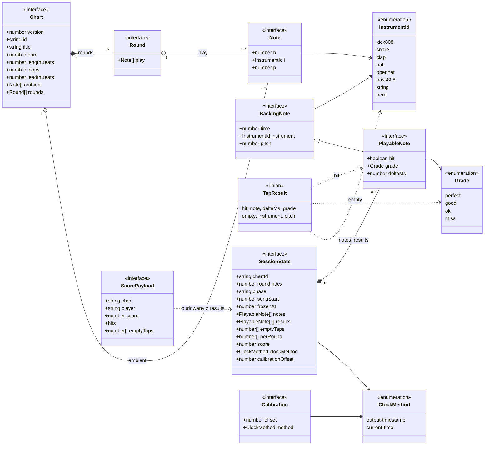
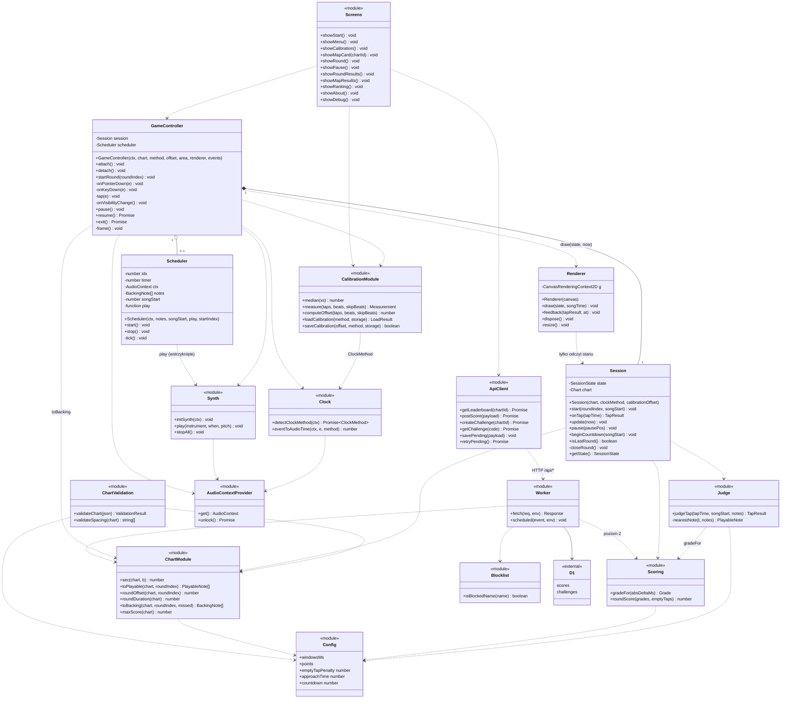

# 13. Diagram klas

Dokument uzupełnia `02-architecture.md` i `12-implementation-plan.md`. Większość logiki w dokumentacji to funkcje w modułach, nie klasy. Dlatego moduły oznaczono stereotypem `<<module>>`, a typy danych `<<interface>>`, `<<enumeration>>` lub `<<union>>`. Klasami w sensie OOP są `Scheduler` (zdefiniowany w `03`), `Session` i `GameController`. Sygnatury `Session`, `GameController`, `Renderer`, `ApiClient` i `Screens` są propozycją planu (etapy 1-3), nie zapisem z pozostałych dokumentów.

## 1. Model danych

Typy z `engine/types.ts`, `engine/chart.ts` i `engine/session.ts`.

Uwagi:

- `Note.p` i `BackingNote.pitch` są opcjonalne (numer nuty MIDI, ADR-015).
- `SessionState.frozenAt` jest `number | null`; `PlayableNote.grade` i `PlayableNote.deltaMs` są opcjonalne; `Chart.ambient`, `ScorePayload.hits` i `ScorePayload.emptyTaps` są opcjonalne. Mermaid nie obsługuje tu typów unijnych w składni pól.
- `ScorePayload.hits` ma typ `[index: number, deltaMs: number][]`, z indeksem globalnym nuty (`04`, pkt 6).
- `SessionState.phase` przyjmuje wartości `playing`, `paused`, `countdown`, `round-results`.
- `Calibration` to obiekt zapisywany w `localStorage` pod kluczem `hitline.calibration`.
- `PlayableNote` i `BackingNote` nie przechowują `Note`. Powstają z `Note` przez `expand` (rozwinięcie pętli i konwersja beatów na sekundy), więc zależność jest wytwarzaniem, nie agregacją (diagram 2).

## 2. Moduły i klasy

Zależności zgodne z regułami z `02-architecture.md`, pkt 3: `engine` nie importuje `render`, `ui`, `game` ani `audio` (poza `engine/clock`); `engine/types`, `engine/chart`, `engine/scoring` i `engine/config` nie zależą od API przeglądarki, bo importuje je także Worker; `GameController` jest jedynym miejscem łączącym DOM, audio i `Session`.

## 3. Mapowanie na pliki

| Element | Plik | Źródło w dokumentacji |
|---|---|---|
| `InstrumentId`, `Grade`, `BackingNote`, `PlayableNote`, `ScorePayload` | `src/engine/types.ts` | `02`, pkt 5; `04`, pkt 6 |
| `Note`, `Round`, `Chart`, `ChartModule` | `src/engine/chart.ts` | `04`, pkt 2, 5-6 |
| `Config` | `src/engine/config.ts` | `12`, etap 1 |
| `Judge`, `TapResult` | `src/engine/judge.ts` | `03`, pkt 4 |
| `Scoring` | `src/engine/scoring.ts` | `01`, pkt 4; `03`, pkt 4 |
| `Clock`, `ClockMethod` | `src/engine/clock.ts` | `03`, pkt 3 |
| `CalibrationModule`, `Calibration` | `src/engine/calibration.ts` | `03`, pkt 5 |
| `Session`, `SessionState` | `src/engine/session.ts` | `02`, pkt 4-5 |
| `GameController` | `src/game/controller.ts` | `02`, pkt 3-4; `03`, pkt 7-8 |
| `AudioContextProvider` | `src/audio/context.ts` | `03`, pkt 2 |
| `Synth` | `src/audio/synth.ts` | `05`, pkt 2 |
| `Scheduler` | `src/audio/scheduler.ts` | `03`, pkt 6 |
| `Renderer` | `src/render/canvas.ts` | `03`, pkt 8 |
| `ApiClient` | `src/net/api.ts` | `06`, pkt 2 i 9 |
| `Screens` | `src/ui/*` | `11-ux.md` |
| `Worker`, `Blocklist` | `worker/index.ts`, `worker/blocklist.ts` | `06`, pkt 4-5 |

## 4. Założenia projektowe widoczne na diagramie

1. `Session` jest czystą logiką: czas dostaje jako liczbę (`onTap(tapTime)`, `update(now)`), nie zna DOM ani audio, więc testuje się w Node bez atrap Web Audio. `onTap` zwraca `null` poza fazą `playing`, więc sesja sama pilnuje ignorowania kliknięć niezależnie od kontrolera.
2. `CalibrationModule` dostaje `Storage` jako argument (domyślnie `localStorage`); `loadCalibration` rozróżnia brak kalibracji (`missing`) i zmianę metody zegara (`method-changed`), bo `11-ux.md` ma dla nich różne komunikaty.
3. `GameController` łączy zdarzenia wejścia, zegar, kalibrację, `Session`, `Synth` i `Scheduler`. W nim jest procedura pauzy i wznowienia (`03`, pkt 7) oraz pętla rAF.
4. `Scheduler` nie zna `Synth` bezpośrednio. Dostaje `AudioContext` i funkcję `play` w konstruktorze, więc można go testować z atrapami.
5. `Judge` mutuje przekazane `PlayableNote` (`hit`, `grade`, `deltaMs`). Stan nut należy do `SessionState`, a `Judge` jest bezstanowy poza tą mutacją.
6. `SessionState.results` przechowuje nuty zakończonych rund; z niego powstają `ScorePayload.hits` i zbiór `missed` dla wariantu B z ADR-006.
7. `Worker` importuje tylko moduły niezależne od przeglądarki (`ChartModule`, `Scoring`, `Config`, `types`).
